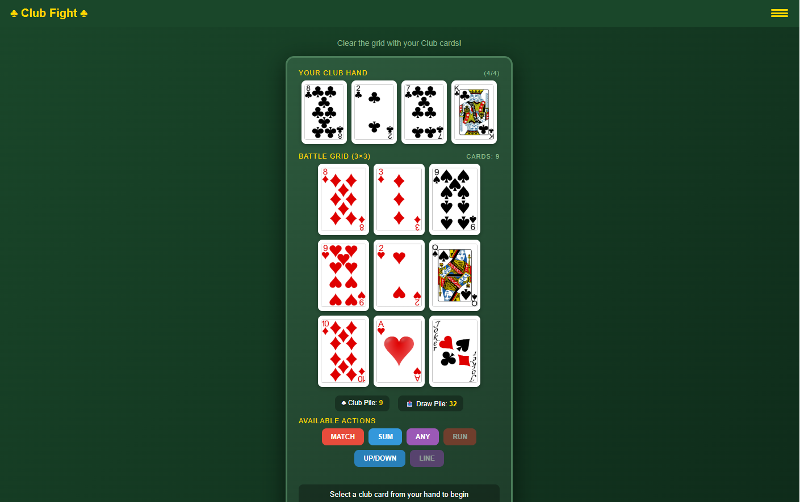

# ♣ Club Fight ♣

A card-matching puzzle game where you clear a 3x3 grid using your club cards!

## Gameplay

## How to Play

- You have a hand of **club cards** and a **pile of reserve clubs**
- There's a **3x3 grid** of face-up cards you need to clear
- Select a club card from your hand, then choose an **action**:

| Action | How It Works |
|--------|--------------|
| **Match** | Remove all grid cards matching your club card's rank |
| **Sum** | Click grid cards that sum to your club card's value (A=1, J=11, Q=12, K=13) |
| **Any** | Remove any single grid card |
| **Run** | Build a sequential run (cards must be in numerical order) |
| **Up/Down** | Click cards either all higher or all lower than your club card |
| **Line** | Pick a grid card, then choose to clear its entire row or column |

## Action Requirements

Some actions are blocked by suit dominance in the grid:
- **Run** (♥) — blocked if 3+ hearts in grid
- **Up/Down** (♠) — blocked if 3+ spades in grid
- **Line** (♦) — blocked if 3+ diamonds in grid

## Win/Lose Conditions

- **Win**: Clear all cards from the 3x3 grid
- **Lose**: No clubs remaining while grid still has cards, OR all actions are blocked

## Features

- Auto-saves game progress to localStorage
- Progress restores on page refresh
- Reset and clear state via hamburger menu
- Celebratory confetti on victory!

## Running

Simply open `clubfight.html` in any modern web browser.

## License

MIT